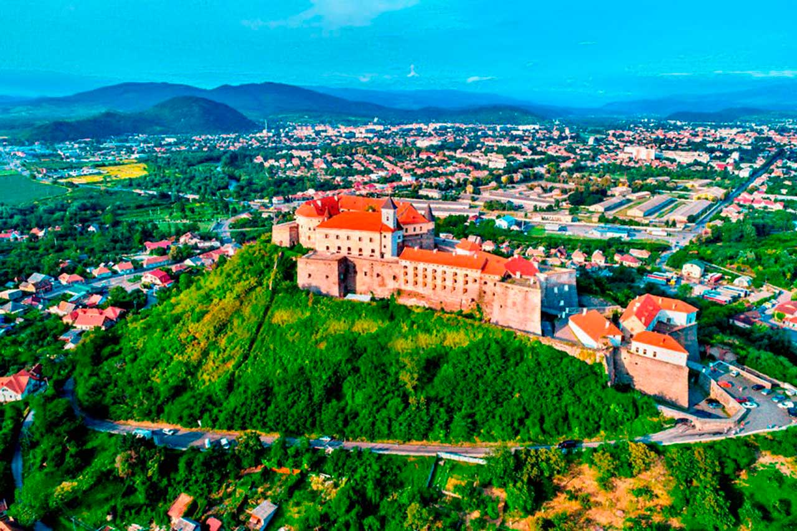
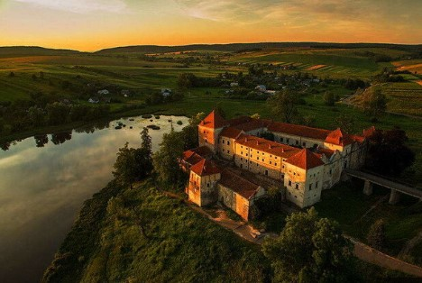
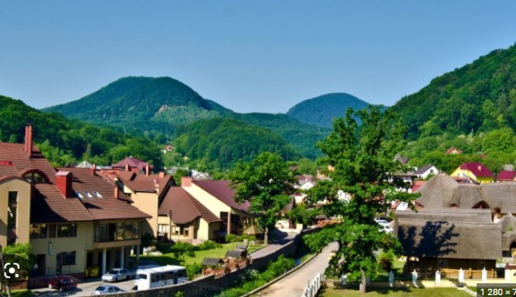

<!doctype html>

<html lang="uk" >

<head>

<meta charset="UTF-8">

<title>Графіка</title>

</head>

<body>

<H2>Курорти Карпат </H2>

<table>

<tr>

<td></td>

<td></td>

<td></td>

<td></td>

</tr>

<tr>

<td>
<H2><a href="https://ru.wikipedia.org/wiki/Драгобрат">Драгобрат</a></H2>
</td>

<td>
<H2>Мукачево</H2>
</td>

<td>
<H2>Буковель</H2>
</td>

<td>
<H2>Яремче</H2>
</td>

</tr>

<tr>

<td></td>

<td></td>
    
<td></td>
    
<td></td>

</tr>

<tr>

<td>
<H2>Коломия</H2>
</td>

<td>
<H2>Славське</H2>
</td>

<td>
<H2>Замки Львівщини</H2>
</td>

<td>
<H2>Хуст</H2>
</td>

</tr>

</table>

   

<video src="10 найбільш зруйнованих міст України.mp4" width=”350” controls video>

</body></html>
